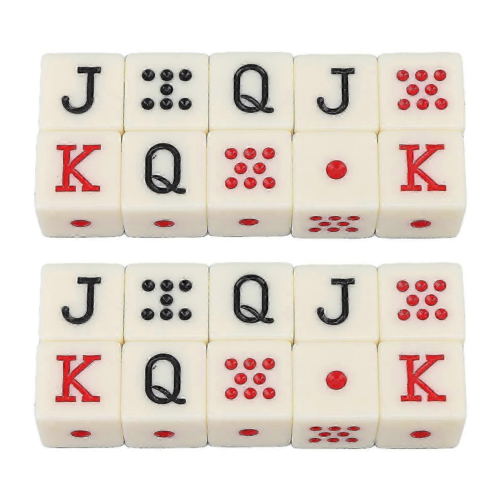

[](https://classroom.github.com/a/MtE8lzv5)
# IDG2100-2026-oblig1

This document contains the description and starter code for `oblig1: IDG2100 Spring 2026`.

You are free to modify the starter code to customise the layout and create a theme more suitable for you. Make sure all the functionalities are included in the new layout.

# Goal

* Prove your understanding about `Web components` and how to use them.
* Demostrate you can create and build resuable `Web components` that can be used in any project or static webpage. 
* Show that you can pass data to a `Web components` from an ancestor and understand when to use `HTML attributes` or `properties` 
* Show you can pass data from a `Web component` to an ancestor using `Custom events`
* Demostrate you can provide CSS style encapsulation with your components
* Prove you can expose a way to customise or theme the Web component via CSS Custom Properties

The project is evaluated based on the previous goals. Therefore, you must show you understand all the previous concepts to get a passing grade. You may want to add a `readme` file to clarify any decision taking during the design/implementation process.

# Context

In this "oblig" you will be presented with a description of the problem you have to solve using Web component(s). 

This is an **individual task**, and you are required to build the component(s) from the ground up. Although, you may utilise snippets of code from tutorials or official documentation, you must clearly acknowledge the sources in the comments of your code. Plagiarism or cheating will be deemed to have taken place if the submitted code shows substantial similarities to other students' assignments or projects found online. In such cases, the matter will be reported to the NTNU appeals committee for further examination. If you have any doubts regarding the use of materials for your project, please reach out to the instructor for clarification. 

If the assignment is graded as "not approved" you will have an additional opportunity based on the following conditions:

1. The first version of the project must have been delivered within the set deadline (never after);
1. The project must consist on a significant piece of work (i.e.: do not deliver an empty assignment);
1. The second version of the project will have to include an additional task (as described later - See [Optional task](#Optional%20task)).

---


# Brief: Spanish Dice Poker — A Web Components–Based Game
**Spanish Dice Poker** is a two‑player dice game played with five six‑sided “poker dice” whose faces represent `A, K, Q, J, 8, 7`. In each round, both players roll up to three times, holding any dice they wish between rolls, to form the **best poker hand**. The round winner earns a point; the **match winner** is the first to reach the configured “best‑of” target (e.g., best of 3, 5, or 7). Dice remain visible on the board until the next round begins.

## The Dice Faces

Each die has six faces represented by traditional playing card ranks and pip dots:

- **Ace (A):** Represented as a large red dot symbol. Often treated as the highest face.
- **King (K):** Marked with the letter "K" in red.
- **Queen (Q):** Marked with the letter "Q" in black.
- **Jack (J):** Marked with the letter "J" in black.
- **Eight (8):** Represented by red dots arranged to show the number 8.
- **Seven (7):** Represented by black dots arranged to show the number 7.



## Course rules (configurable by attributes)

> - **Face order (high→low):** `A > K > Q > J > 8 > 7`
> - **Hand rankings** (best to worst):
>
> | Rank | Spanish Name | English Name | Description | Example |
> |------|---|---|---|---|
> | 1 | Repóker | Five of a Kind | All five dice show the same face | A-A-A-A-A |
> | 2 | Póker | Four of a Kind | Four dice show the same face; one different | K-K-K-K-7 |
> | 3 | Full | Full House | Three dice of one face + two dice of another face | Q-Q-Q-8-8 |
> | 4 | (*)Escalera | Straight | All five dice show different faces in one of two allowed sequences | 7-8-J-Q-K or 8-J-Q-K-A |
> | 5 | Trío | Three of a Kind | Three dice show the same face; two others different | J-J-J-8-7 |
> | 6 | Doble Pareja | Two Pairs | Two dice of one face + two dice of another face; one different | K-K-8-8-7 |
> | 7 | Pareja | One Pair | Two dice show the same face; three others different | 7-7-Q-J-8 |
> | 8 | Carta Alta | High Card | All five dice show different faces (no matching combinations) | A-K-J-8-7 |
>
> - **(*)`include-straight` attribute:** When `true` (default), straights are allowed. A straight requires **all five dice to show different faces** in one of these two sequences: `7-8-J-Q-K` (low straight) or `8-J-Q-K-A` (high straight). When `false`, straights are not valid hands.
> 
> These reflect common poker‑dice conventions and known Spanish sets; the attributes make rules explicit for this course. 

# Gameplay
1. **Round Start:** The board announces the new round; dice render visible. All holds are cleared and both players can roll.  
2. **Player Turn:** A player receives an automatic first roll of all five dice. After each roll, the player may **hold** any dice and re‑roll the remaining ones. A player may re‑roll **up to two additional times** (for a total of three rolls maximum per turn).  
3. **Second Player Turn:** Same flow—first roll, then up to two re‑rolls.  
4. **Round End:** The board evaluates both final hands using the configured rules (hand rankings and tie‑breaking, see below) and announces the **round winner** with the winning hand type.  
5. **Match Progress:** The scoreboard updates the best‑of progress. The **match winner** is the first player to win **ceil(bestof/2)** rounds. For example: best‑of‑3 = first to 2 wins; best‑of‑5 = first to 3 wins; best‑of‑7 = first to 4 wins. When a player reaches this target, the **match ends** and they are crowned the champion.  
6. **Dice Visibility:** Both players' final hands **remain visible** on the board after the round ends. They stay visible until the player clicks "Start Next Round". At that point, all holds are cleared, the dice are reset, and a new round begins.


# Task: Build the Game Using Web Components
Implement the game using Web Components and **event-based communication**. Your solution must include **(at least) these components**:

- `<dice-poker-board>` — orchestrates the game (2 players, turns, rounds, scoring, rules).
- `<dice-poker-die>` — renders and manages a single die (face, hold, roll, events).
- `<dice-poker-monitor>` — passively **displays** the current round, whose turn, remaining rolls, last results, round winner, and match score.

To complete this task successfully, you must:
- Implement **custom events** for all cross‑component communication.
- Provide clear, responsive rolling and hold toggling.
- Keep the dice **visible** until a new round begins.
- Provide clear **winner announcements** with the winning hand type and match progression.
- Allow **match restart** and **rule configuration** via attributes (`bestof`, `include-straight`).
- Implement **hand evaluation and tie-breaking** logic so that both players' final hands are compared correctly and a clear winner is announced.

# Game Components

## Dice Poker Board (`<dice-poker-board>`)
Coordinates players, turns, rounds, and scoring.

### Attributes
- `player1`, `player2`: Player names (string).
- `bestof`: `3 | 5 | 7` (default: `3`). Determines match length: first to `ceil(bestof/2)` wins.
- `include-straight`: `true | false` (default: `true`). When `true`, straights are valid hands; when `false`, they are ignored.

### Functionality
- Starts rounds and manages turns between the two players.
- Enforces the **three-roll limit** per turn (one automatic roll + up to two re-rolls) and tracks **held** dice for each player.
- **Evaluates both final hands** using the configured rules (hand rankings and tie-breaking) and announces the **round winner** with the winning hand type.
- **Updates match progress** and emits a **match-decided** event when someone reaches `ceil(bestof/2)` wins, determining the match champion.
- Keeps both players' final hands **visible on the board** until the player clicks to start the next round.

### Events
- `dp:round-start` — when a new round begins; payload `{ round: number }`.  
- `dp:turn-changed` — when the active player changes; payload `{ player: 'player1' | 'player2', remainingRolls: number }`.  
- `dp:roll-executed` — after a die roll; payload `{ player: 'player1' | 'player2', faces: array, held: array }`.  
- `dp:round-decided` — when a round ends; payload `{ winner: 'player1' | 'player2', hands: { player1: { faces, handType }, player2: { faces, handType } }, breakdown: string }`.  
- `dp:match-decided` — when the match finishes; payload `{ champion: 'player1' | 'player2', scoreline: { player1: number, player2: number } }`.
## Dice (`<dice-poker-die>`)
Represents a single Spanish poker die (faces: `A K Q J 8 7`).

### Attributes
- `face`: `A | K | Q | J | 8 | 7`.
- `held`: `true | false`.
- `owner`: `player1 | player2` (optional).
- `die-id`: Unique identifier for the die (string/number, optional).

### Functionality
- Renders its current face; visually reflects `held`.
- Exposes `roll()` to randomise `face`.
- Emits events on changes.

### Events
- `dp:die-rolled` — `{ dieId, face, owner }`.
- `dp:die-held-changed` — `{ dieId, held, owner }`.

## Turn and Round Monitor (`<dice-poker-monitor>`)
A **read‑only** UI that listens to board events and displays:
- Current **round** and **active player**.
- **Remaining rolls** for the active player.
- Last **faces** rolled and which dice are **held** (optional).
- **Round winner** and **match score** (best‑of).

### Behaviour
- Subscribes to `dp:round-start`, `dp:turn-changed`, `dp:roll-executed`, `dp:round-decided`, and `dp:match-decided` events emitted by the board.
- Displays key updates (e.g., "Round 3 — Player 2's turn, 3 rolls remaining", "Round winner: Player 1 with a Full House", "Player 1 wins the match 2-1").

## Styling and Theming

All components must use **CSS custom properties** for theming. Example:

```css
:root {
  --board-bg-color: #0b5f0b;           /* Card game felt green */
  --die-bg-color: #f5f5f5;
  --die-face-color-red: #cc0000;       /* Red for A, K, 8 */
  --die-face-color-black: #000000;     /* Black for Q, J, 7 */
  --die-held-color: #fbbf24;           /* Highlight when held */
  --player1-color: #3b82f6;
  --player2-color: #ef4444;
}
```

Feel free to define additional properties. Use semantic HTML for your markup.

## Implementation Hint: Hand Evaluation

To evaluate a hand, you may find this approach helpful (but you are free to implement it differently):

1. Count the **frequency** of each face in the 5 dice (e.g., `{A: 2, K: 3}`)
2. Extract the **frequency pattern** in descending order (e.g., `[3, 2]`)
3. Match the pattern to a hand rank:
   - `[5]` → Repóker
   - `[4, 1]` → Póker
   - `[3, 2]` → Full
   - `[3, 1, 1]` → Trío
   - `[2, 2, 1]` → Doble Pareja
   - `[2, 1, 1, 1]` → Pareja
   - `[1, 1, 1, 1, 1]` → Check for Straight or Carta Alta

4. For the `[1, 1, 1, 1, 1]` case, check if the faces form a valid Straight (`7-8-J-Q-K` or `8-J-Q-K-A`). If yes → Escalera, else → Carta Alta.
5. For **tie-breaking**, compare face values using the face order: `A > K > Q > J > 8 > 7`.

This is just a suggestion. You may choose any approach that works for your implementation.
# Optional task
**Implement if your assignment is graded “Not approved” and you qualify for a second iteration (see Context).**

Create a **Game History Tracker** using `localStorage`.

## Requirements
1. **New Component: `<dice-poker-history>`**
   - Listens to `dp:round-decided` and `dp:match-decided`.
   - Stores results in `localStorage` under a key like `DP_HISTORY`.

2. **Persisting Data with `localStorage`**
   - On every round end, append `{ timestamp, winner, hands }` and save.

3. **Displaying History**
   - Read from `localStorage` and display past rounds/matches.
   - Persist across page refresh.

4. **Live Updates**
   - Update the history view whenever a round/match ends, without reloading.

**Testing steps:**
1. Play several rounds/matches.  
2. Verify winners appear in the history UI.  
3. Refresh the page; ensure the history persists and displays correctly.

---

# Delivery

This compulsory assignment consists of two parts: **code submission** and an **individual on-campus oral presentation**. Both parts must be completed to receive a passing grade.  

## Code Submission

Deadline can be found in Blackboard. 

This assignment must be delivered in two different places: GitHub classroom and Blackboard.

- To deliver the assignment in GitHub Classroom, you only need to make sure all your changes and commits are pushed to your Git repository.

- It is imperative that you work exclusively with this Git repository to ensure that all modifications are trackable and your code is backed up on a regular basis. Hence, you should commit your progress directly to this repository each time you make advancements.

- Before delivering the assignment in Blackbard, make sure your project has all the files it needs. Delete any file or info not needed (this is `.git/` folder, etc.). Zip the project and upload the file to Blackboard. 

## Oral presentation

This assignment will also be presented orally in front of the class. During the oral presentation, you will have to **disable AI features in VS Code** and display a **version of the code without any comments**. This ensures you demonstrate that you understand your implementation.

More details will be provided on **Blackboard**.

# DOCUMENTATION

Use this section to document your component.